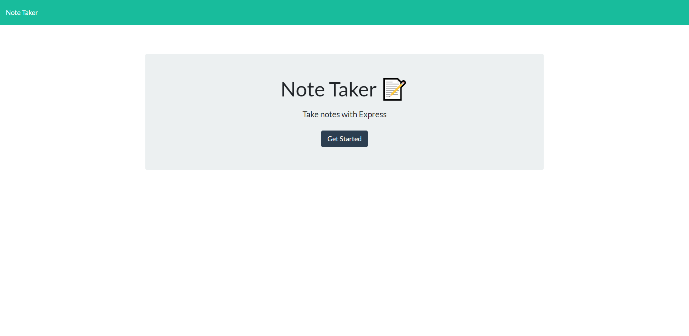
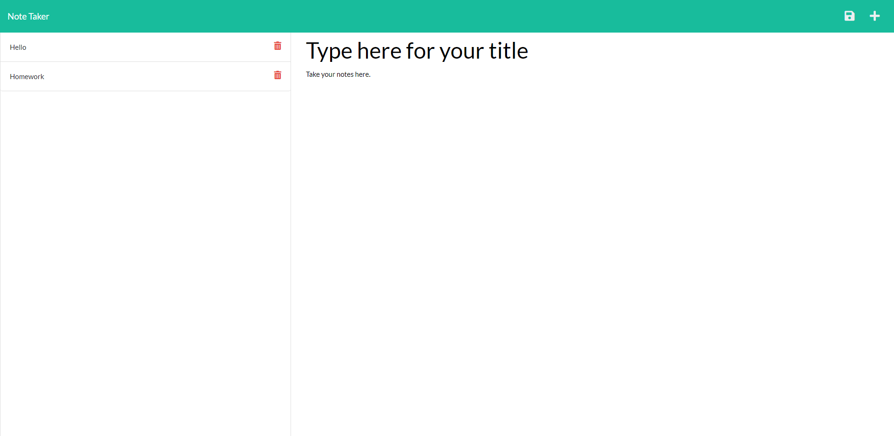

# Note-Taker
  

  ## Table of Contents
  * [Description](#Description)
  * [Installation](#Installation-Instructions)
  * [Usage Instructions](#Usage-Instructions)
  
  * [Contributing Members](#Contributing-Members)
  * [Testing](#Testing)    
  * [Questions/Inquiries](#Questions/Inquiries)

  ## Built with
  JavaScript, HTML, CSS, Express.js, UUID, nodemon

  ## Description
  Note-Taker is an application for taking notes. You can add a title and then in the main body type away what you want to put in your note. Then you can save it and access it later. You can also delete notes as needed

  ## Usage Instructions
  Add a title as needed in the app, and then in the body just jot down your notes to take notes. There is a trash icon for deleting as needed and save icon on the top right to save your notes as needed.

  ## To Access Application
  The application is deployed on [heroku](https://www/.heroku.com/). Follow this link to get to the application https://murmuring-oasis-49858.herokuapp.com/.

  ## Contributing Members
  Ben Vue

  ## Testing 
   N/A

  ## Preview of app final product
  
  

  ### GitHub Profile
  [GitHub Profile](http://github.com/benyvue)

  ### Email
  Please reach me at the provided email with any questions. bvue012@gmail.com